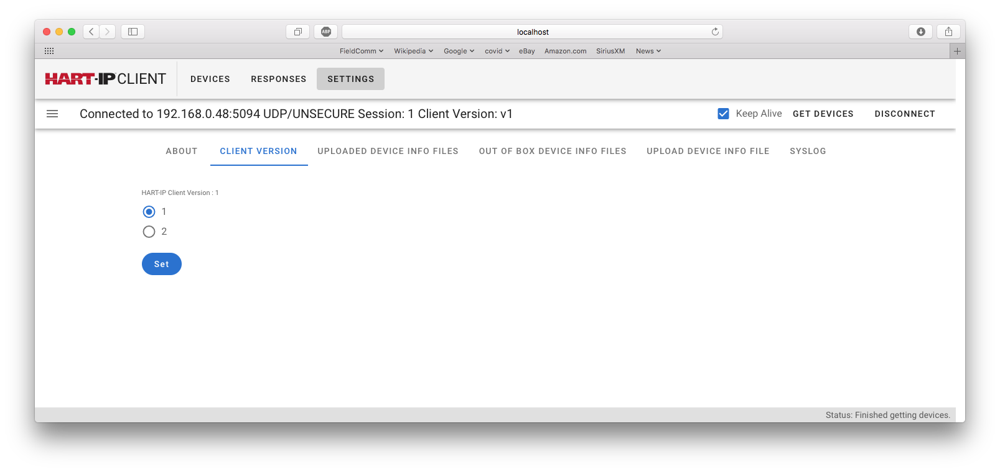
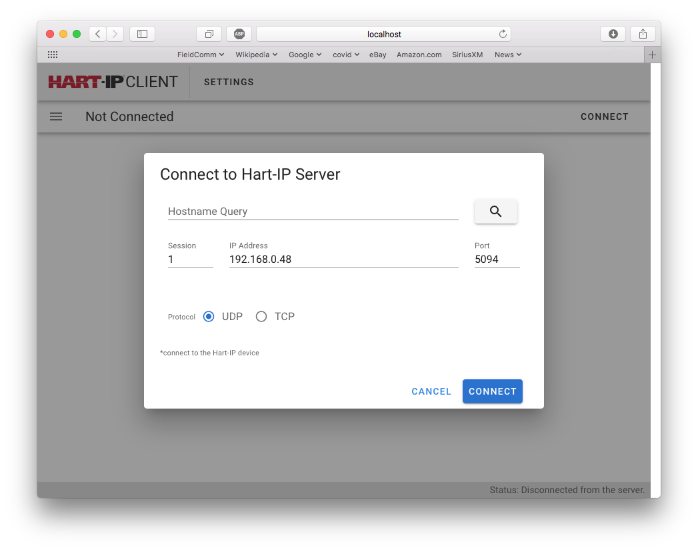
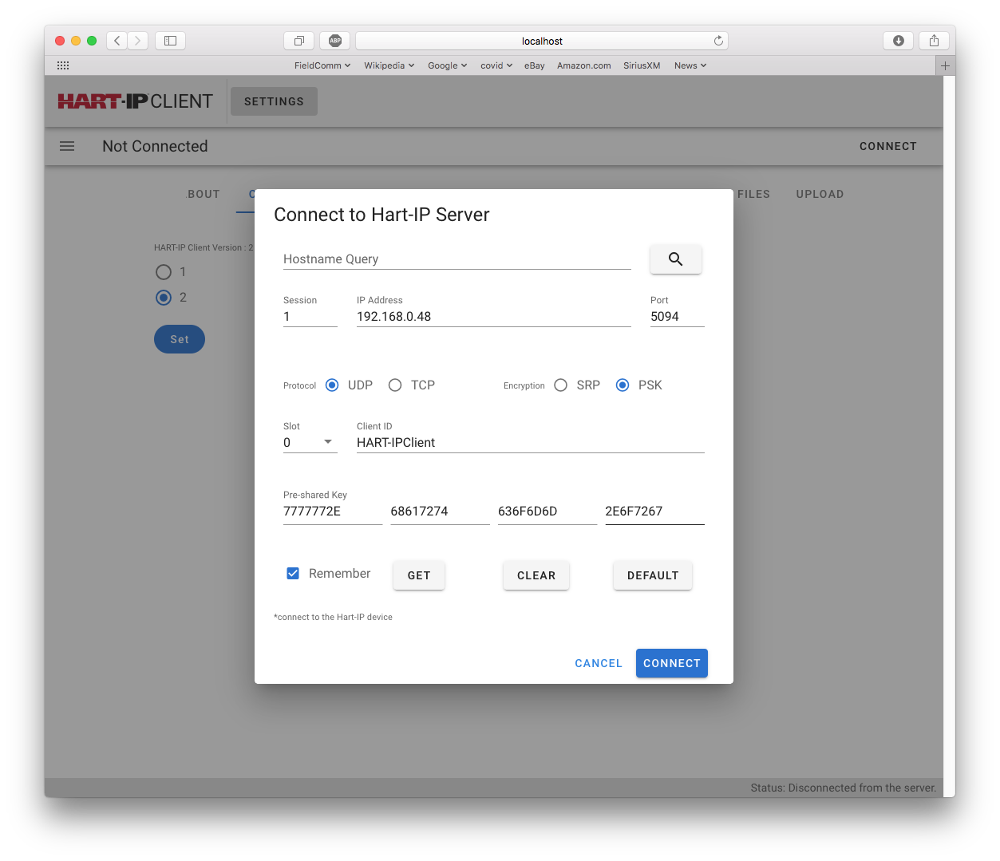

[PREVIOUS: Overview of Portable HART-IP Client Operation](./2-Overview.r1.md)

# 3-Connecting to the Device
On the right-hand side of the Portable HART-IP Client UI is the Connect/Disconnect button.  It is used to connect the client to a HART-IP Device (server).  The Connect dialog will adapt based on the HART-IP version the client is configured for (v1/v2).

## Configuring the client's HART-IP Version
Portable HART-IP Client supports both v1 and v2 servers (i.e., field devices).  When configured as v2 client it will, per protocol requirements, it will operate in backward compatible mode when encountering a v1 device.

In addition, the Portable HART-IP Client can be configured as v1 or v2 to allow the client to be used in first initial connection to a HART-IP device. The following figure illustrates configuring the Portable HART-IP Client.

**Figure** Setting the HART-IP Version used by the Client

The  HART-IP version supported by the Portable HART-IP Client is configured by selecting the "Settings" tab followed by the Client Version tab.  

Version can be set to 1 or 2.  Select the version desired and press "Set"

## Connect when in v1 
The following Figure shows the connect dialog for v1 operation.

**Figure** v1 Connect Dialog

- All HART-IP devices have a HOSTNAME.  On the device's label its MAC Address (i.e., the physical address of it's ethernet port) will be shown in hyphenated form.  After a Factory Reset the device's HOSTNAME is that MAC Address (e.g. b8-27-eb-d1-3d-05).  After provisioning, the HOSTNAME will be the Device's TAG (plus optionally, the Process Unit Tag).  Entering the HOSTNAME allows the device's IP address to be looked up.

- If the IP address is already known it may be entered directly along with the IP Port number.  5094 is the default IP Port for HART-IP.

- HART-IP supports both UDP and TCP.  One or the other is selected for the connection.

- The Portable HART-IP Client supports multiple simultaneous sessions to one or more servers.  The Session field controls the session currently visible. 

Pressing "Connect" initiates the indicated session with the server/device. Once connected, the Session number is displayed along with other connnection details on on the menu bar.

## Connect when in v2
The following Figure shows the connect dialog shown for v2 operation.  The basic connection process is similar to that with v1.  However, security credentials are needed in addition to the port and protocol information.

**Figure** v2 Connect Dialog

The session initialization can be secured by using either Pre-Shared Keys (PSK) or Secure Remote Password (SRP).  In other words, only one of them (Password or PSK) need be entered.  In either case the 

- **Client ID**. The Client ID must be entered.  When security is negotiated and confirmed, the Client ID is used to look up the correct PSK or SRP.

- **PSK**. HART-IP currently supports 128-bit PSK.  As shown in the figure, the 128bit keys are entered as 4 groups of 8 Hexadecimal characters.  

- **SRP**. When SRP is selected the Password field replaces the PSK fields. Only printable ISO Latin-1 characters are allowed.

The PSK/Password entered must align with the Client ID or the server connection will not be successful. 

The Slot number field can be ignored.

Pressing "Connect" initiates the session with the server/device.

## Next Steps
Once the Portable HART-IP Client is connected,  interaction with the HART-IP device is now possible.  Clicking on the "Devices" display a list of the connected sessions and the corresponding server/device.  See the following Figure.
 

**Figure** The Devices List

Pressing "Detail" will open the Devices Screen that supports device interaction.

[NEXT: Initial Device Provisioning](./4-Initial%20Device%20Provisioning.r1.md)
