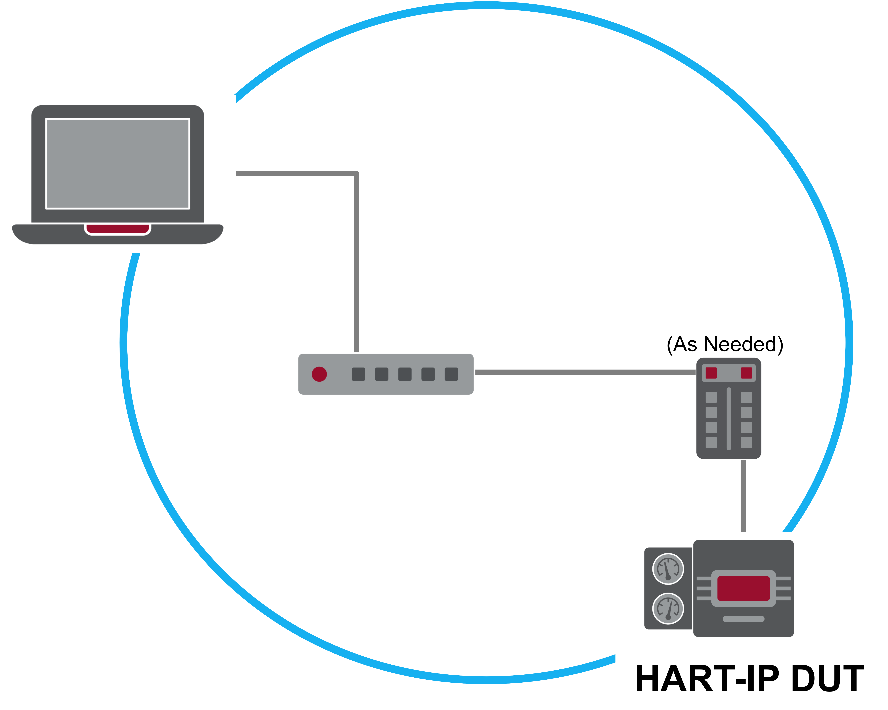
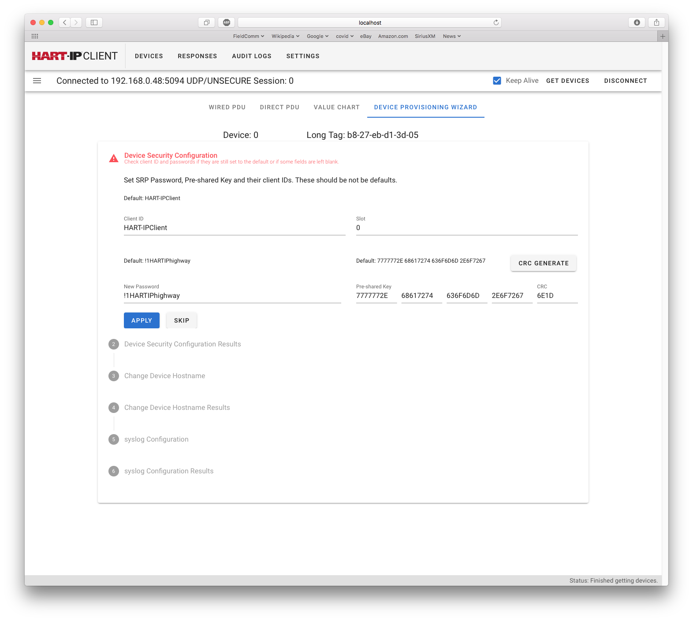
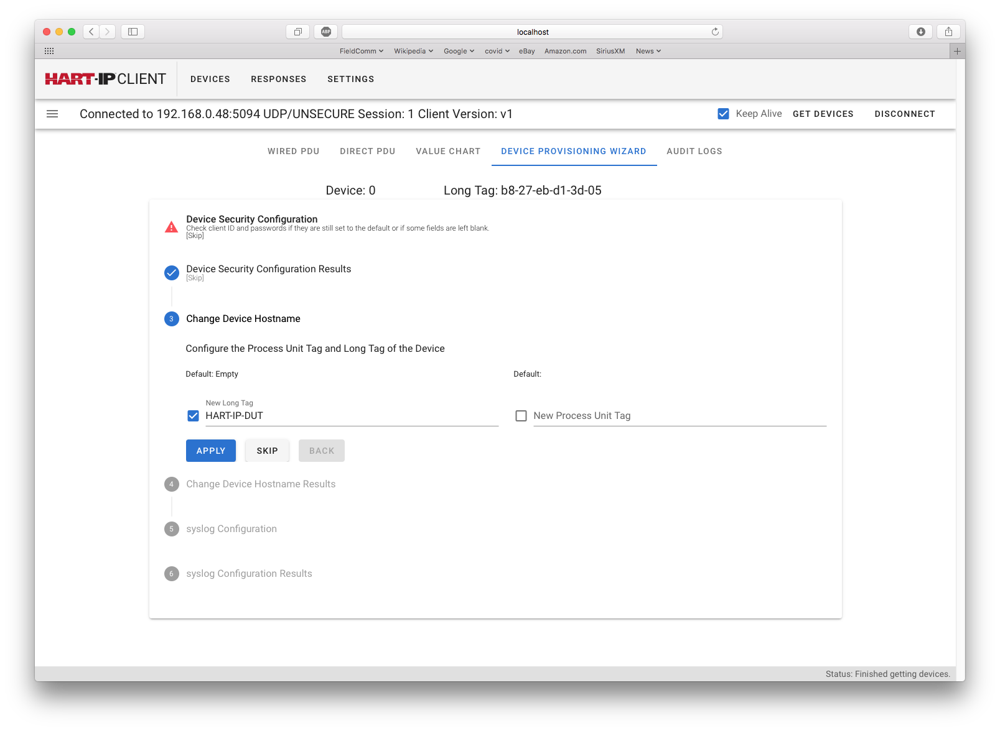
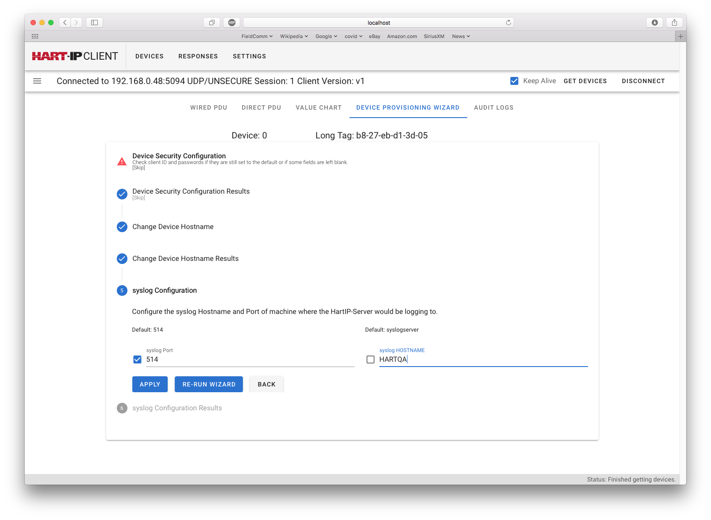

[PREVIOUS: Connecting to the HART-IP Device](./3-Connecting%20to%20the%20device.r1.md)

# 4-Initial Device Provisioning
the Portable HART-IP Client supports the initial provisioning of a new device or one that has just been Factory Reset.  The basic steps to initial provisioning include:

- Unpacking and inspection of the device.

- Provisioning Security Manager

- Setting the HOSTNAME

- The syslog Server Connection 

## Unpacking and inspecting a new HART-IP Device
Deployment of a HART-IP device follows the same basic process used by HART 4-20mA and WirelessHART devices today.  It begins with unpacking and inspection.

- The device is unpacked and physically inspected

- Confirm MAC address on label.  The hyphenated MAC address must be clearly stated on the DUT.  After Factory Reset this is the DUT HOSTNAME 

- Identify Factory Reset.  All HART-IP devices must have a Factory Reset button or jumper and it must identified and accessible.  

- Identify the network and power connections.  Documentation supplied with the device should identify these connections (types and requirements) to enable connection to the plant network. In other words, how do you mount and wire the device?

At this point the HART device is normally connected on the instrument technician's bench.  The network (including the Portable HART-IP Client) may look like that shown in the following figure. HART-IP was desired to work without the need for any network infrastructure.

**Figure** Bench-top HART-IP network

Initial provision should start by executing the Factory Reset. Then the following basic provisioning can be performed.

## Provisioning the "Security Manager" 
Once the Portable HART-IP Client is connected to the device, pressing the *"Devices"* then *"Detail"* then *"Device Provisioning Wizard"* will start the wizard. The wizard provides step-by-step guidance for minimal provisioning needed by a HART-IP device.

Assuming the initial connection is as a v2 client, the slot 0 (Security Manager) credentials must be established. See the following figure.

**Figure** Setting the Initial Security Credentials

The Protocol defines the "Security Manager" as the Client ID and credentials assigned to Slot 0 in the HART-IP Device. Only the Security Manager can manipulate security credentials. It is essential the slot 0 credentials be applied. If this step is skipped then another Factory Reset will be required to recover the device. In the above figure:

- Slot must be set to "0" (zero);

- Client ID must be entered

- Either the PSK of the Password (or both) must be entered

The Slot 0 credentials (Client ID, PSK, Password) should be changed to a new, secret value.  

Once the credentials are entered press the "APPLY" button. The results (successful or not) will be shown in the next screen. 

## Setting the Device's HOSTNAME
The next step is entering the device's HOSTNAME (see the following figure).  In HART-IP, the TAG (plus the optional Process Unit Tag) is used as the HART-IP device's HOSTNAME.  Consequently, the normal instrument technician practice of entering the device's Tag also sets the HOSTNAME.

**Figure** Setting the HOSTNAME 

If the initial connection is as a v1 client then this will be the first screen shown in the Device Provisioning Wizard.

Per IP standards, HOSTNAME must only include letters, digits and hyphens ("LDH"). The dialog will only accept legal HOSTNAMEs. If the Long Tag or Process Unit Tag contains anything other that LDH the "APPLY" will be grayed out (i.e., inoperative).

Once the Long Tag (and optionally the Process Unit Tag) are entered and the check box(es) ticked, pressing APPLY provisions the Long Tag, Process Unit Tag and thus the HOSTNAME. From now on any clients connecting to the HART-IP device only need know the device's Tag.  Most process automation applications make extensive use of device Tags for identifying and tracking field devices. HART-IP use of Tags as HOSTNAME aligns well with that practice.

## The syslog Server Connection
Finally the syslog server connection must be configured (see the following Figure).  The syslog server, in IP networks, are used to monitor, maintain, and troubleshoot networks.  HART-IP devices will send notifications to the syslog server every time: 

- A client connects to or disconnects from the server, 
- The configuration is changed, 
- The security is changed
- The device power is cycled, and
- Periodically when a client is connected a long time

**Figure** Setting the syslog Server

The syslog server HOSTNAME and IP Port should be entered and applied. 

## Next steps
After the provisioning is complete the Portable HART-IP Client must close this initial session (connection).  No other clients can connect to the device while the initial session is active.

Complete provisioning of the device (i.e., configuring the unit codes, range values, burst messages, etc.) can be completed on the instrument technician's bench or after device deployment (whichever is the plant's policy).

[NEXT: Working with the Device](./5-Working%20with%20the%20Device.r1.md)
