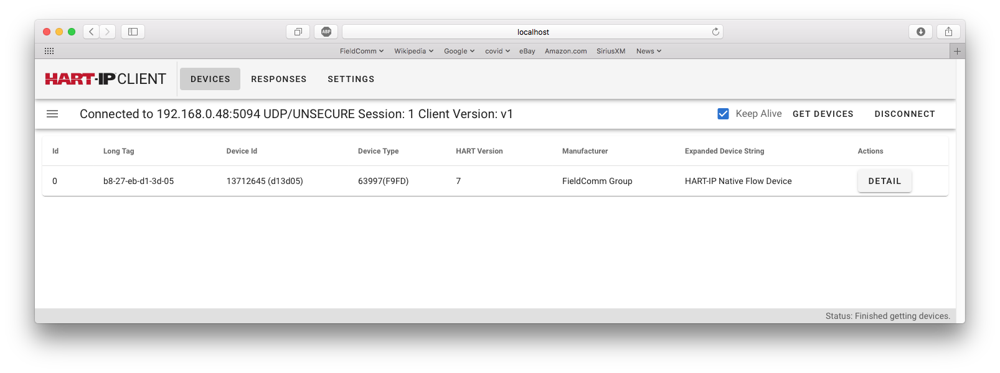
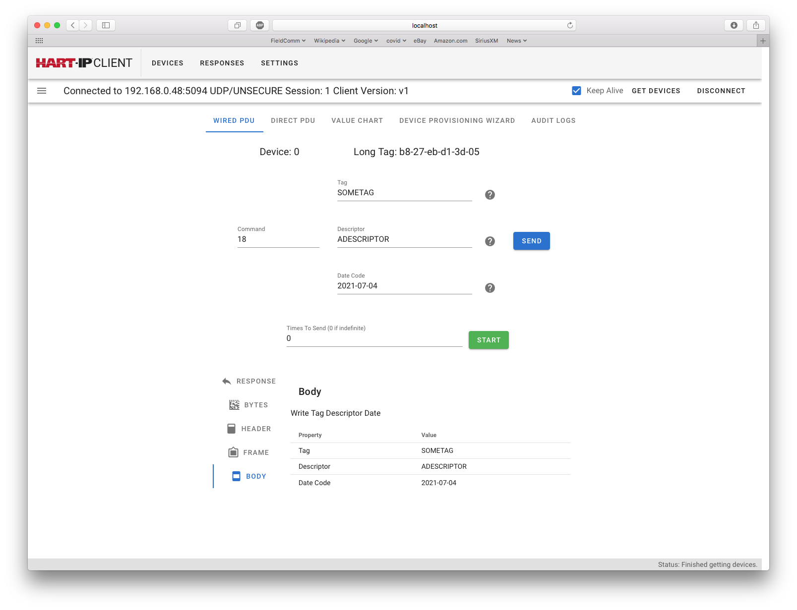
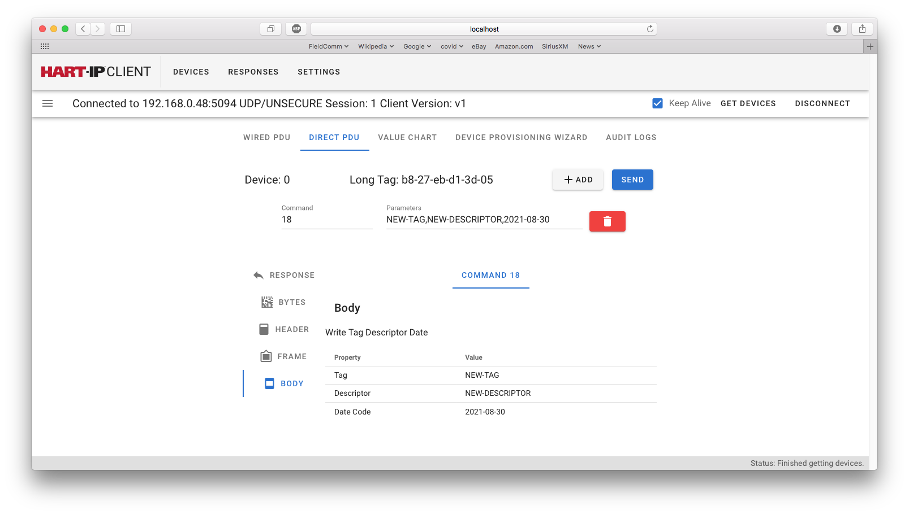
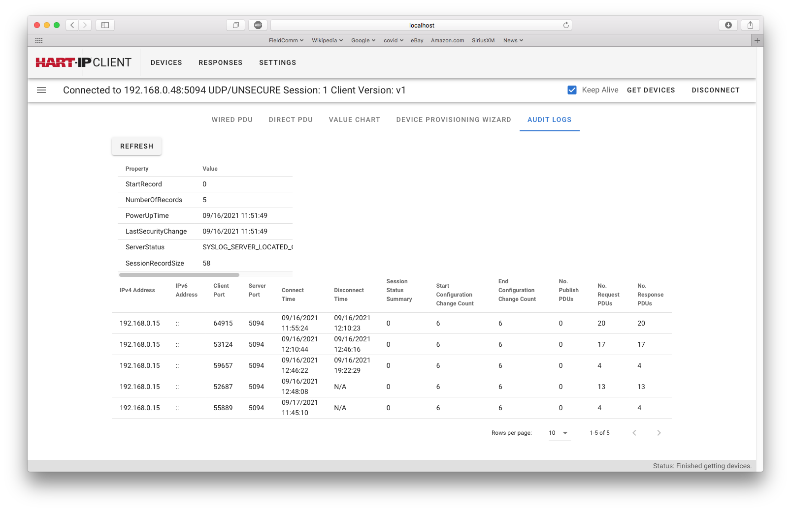

[PREVIOUS: Initial Device Provisioning](./4-Initial%20Device%20Provisioning.r1.md)

# 5-Working with the Device
So far, the procedure for connecting to a device and performing the initial provisioning have been described.  Once the Portable HART-IP Client is connected to a device broader interaction with the device is possible.

First, pressing the *Devices* tab on the top menu bar will show a list of the connected devices similar that tat in the following figure

**Figure List of Devices Connected via HART-IP**

Selecting *Detail* will show tabs that allow access to the HART-IP device.
Interaction with the HART-IP device occurs via three primary screens:

- Wired PDU, 

- Direct PDU, and

- Audit Logs
 
The Device Provisioning Wizard was discussed in a previous chapter and the Value Chart tab is not addressed at this time.

## Wired PDU
The Wired and Direct PDU tabs allow HART Commands to be sent to the device. The Wired PDU (see the following figure) works with HART-IP v1 and v2 devices sending one command at a time. 

**Figure** Wired PDU

The Portable HART-IP Client supports DeviceInfo style JSON descriptions of commands and data.  The UniversalCommandList.json file supports all Universal and many Common Practice Commands.  Consequently, when entering command request for Wired PDU, the request fields will appear to simplify command construction.

In the *Figure Wired PDU* Command 18 is entered.  The Portable HART-IP Client looks up the command and displays the Tag, Descriptor, and Date field for entry.  Once all the fields are entered the *SEND* button is pressed.

The command is sent and the result (Success, Warning or Error) is shown. Selecting *BODY* displays the parsed response.

Any command can be sent to the device even if the command is not known in advance to the Portable HART-IP Client.  In that case, the hexadecimal bytes will need to be entered manually and the response parsed manually as well.  

## Direct PDU
The Direct PDU is supported in HART-IP v2.  The Direct PDU supports better utilization of the IP connection by allowing multiple commands to be sent in a single transaction. The following figure shows the entry of Command 18 in a Direct PDU.  For the Direct PDU the request data is entered comma-separated for commands known the the Portable HART-IP Client.  

Pressing the "ADD" allows more commands to be entered.  In fact, most, if not all, of the device's configuration could be read in one transaction.

**Figure** Direct PDU

Selecting the *Body* shows the parsed response for the command in the same fashion as with the Wired PDU.  If there are multiple commands the parsed responses for each are displayed side by side. The response of interest can selected by selecting the appropriate command number.

## Audit Logs
Audit Logs are also a HART-IP v2 addition.  Audit Logs summarize the HART-IP device's activities.  The Audit Log includes an overall summary (the Audit Log header) and then individual records of the clients that have interacted with the device. The Audit Log is volatile and cleared on a Power Cycle.

The Audit Log header records when the device was powered up and when the security credentials were last changed.  In addition, summarizes (see *Table Example of Server Status*) issues with its connection to the syslog server.

**Figure** Reading the Audit Log.

One record is maintained to summarize each client session made with the device. A record is generated whether the client connects successfully or not.  Each record contains:

- The identity of the Client (IP address and ports used)
- The connect and disconnect time.  Disconnect time will be undefined if the client is still connected.
- Session Status (See *Table Example of Session Status*)
- The Configuration Changed Counter (may not be updated until session is closed)
- Communication statistics

**Table**. Example of Session Status

|Mask| Description|
|:--|:--|
|0x0001|Writes Occurred. The client changed the configuration of the device |
|0x0002|Bad Session Initialization. A client tried to connect to the device but was unsuccessful.  This can be an indication that a client without valid security credentials attempt to access the device. |
|0x0004|Aborted Session. The client sent a request that was illegal (not allowed), invalid (poorly formed), or corrupted. This generally means the client doesn't know what it is doing or is attempted to hack the device.|
|0x0008|Session Timeout. Communication with the client lapsed.  For examples, keep-alives were not received in a timely fashion or communication was lost. |
|0x0010|In-Secure Session. This bit is set when the device is operating in v1 backward compatible mode. |

Taken together,  the Audit Log provides major insights into the operation of the device and what clients are doing with the device. 
 
[NEXT: Reading the Syslog](./6-Reading%20the%20syslog.r1.md)

