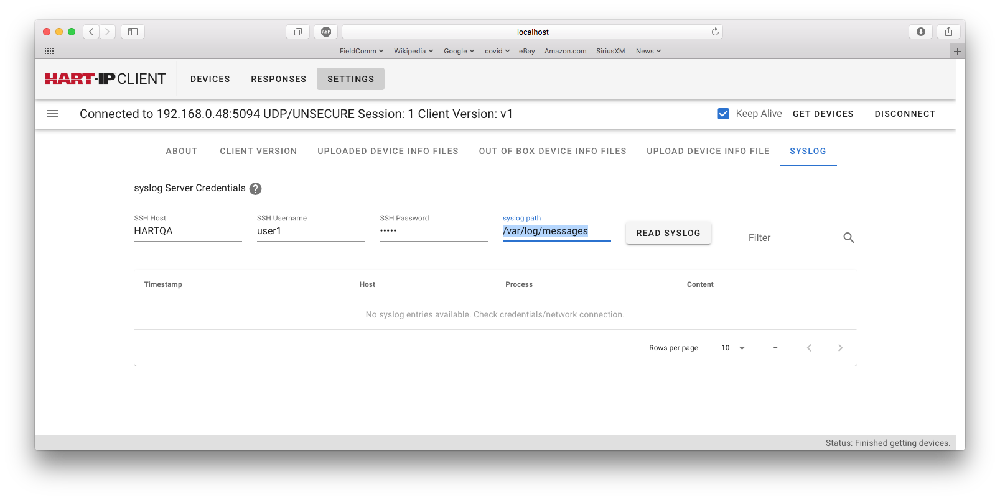

[PREVIOUS: Working with the Device](./5-Working%20with%20the%20Device.r1.md)

# 6-Reading the syslog
syslog is a standard network messaging facility that allows network devices to log significant event to a central syslog server.  In the case of syslogging

- The syslog Server (message receiver) is the central syslog message repository.

- The syslog Client (message transmitter) is the network device generating the messages.  

For HART-IP, the syslog Client is the field device, I/O System or WirelessHART Gateway.  This should not be confused with the role of a HART-IP field device, I/O System, or Gateway being the HART-IP Server for HART-enable applications (HART-IP Clients).

All v2 HART-IP devices support syslogging.  syslogging complements Audit Logs and is part of the HART-IP v2 defense in-depth security strategy that includes:

- **Communication**. Industry standard TLS secures HART-IP communications.

- **Diagnostics**. Audit Logs summarizes actions performed by HART-IP Clients on that specific HART-IP device. 

- **Forensics**. syslog messages record timestamped events from all network devices to enable system-wide troubleshooting / investigation.

Basically secure communications are resistant to cyber-attacks. Audit Logs and syslogs reinforce secure communications by enabling easy detection of anomalies and mischief

## HART-IP syslog messages
HART-IP v2 devices support more than 15 types of messages including:

- The power cycling of a device
- records of firmware updates
- connection and disconnection of client
- client subscribing to published process and status data
- Each change in the device configuration

Each message includes time stamps (to the millisecond), the Event-description, and the client performing the action. 

## accessing the syslog

Access to the syslog server is via the *SETTINGS* button then the *SYSLOG* button.  The following Figure shows the syslog dialog.  To read the syslog file you must have a username on the syslog server computer.  Access is via remote login using SSH.  The following must be entered:

- **SSH Host**.  The HOSTNAME of the computer the syslog server is running on.

- **SSH Username + SSH Password**.  Your account on the syslog server computer

- **syslog path**.  The path to the syslog file.

**Figure** Reading the syslog.

Once these are entered, pressing the *READ SYSLOG* button will fetch the syslog file.  The syslog file will contain many messages from many application running on the devices connected to the network.  To reduce the messages to be inspected the last entry on the right allows the messages to be filtered.  For example, the HOSTNAME of the field device of interest could be entered.  Then only messages from that HOSTNAME would be shown.

The Portable HART-IP Client only supports simple browsing.  There are applications the specialize in parsing and analyzing syslog files.  These applications provide both reports and summaries. Some even utilize specialized databases for syslog data.

## HART-IP syslog messages
The following are samples of three HART-IP syslog messages.  As can be seen the messages are moderately detailed.  The key is that the pattern is well defined with simply  delimited elements in the message.  These simplifies automated parsing.
 
> Sep 15 16:12:31 b8-27-eb-ac-14-fc.local <118> 2021-09-15T21:12:31.959Z b8-27-eb-ac-14-fc CEF:0|0x00F9|0xF9FD|0x02|1001|Client '192.168.0.132:57764' disconected|1|DeviceID=0xAC14FC src=192.168.0.138 c6a2=fe80::ba27:ebff:feac:14fc dst=192.168.0.132

> Sep 15 16:12:31 b8-27-eb-ac-14-fc.local  <134> 2021-09-15T21:12:31.959Z b8-27-eb-ac-14-fc CEF:0|0x00F9|0xF9FD|0x02|1200|192.168.0.132:42209: 0, 6, 6, 0|1|DeviceID=0xAC14FC src=192.168.0.138 c6a2=fe80::ba27:ebff:feac:14fc dst=192.168.0.132

> Sep 15 16:12:37 b8-27-eb-ac-14-fc.local  <118> 2021-09-15T21:12:37.360Z b8-27-eb-ac-14-fc CEF:0|0x00F9|0xF9FD|0x02|1000|Session initiated. 192.168.0.132:60744|1|DeviceID=0xAC14FC src=192.168.0.138 c6a2=fe80::ba27:ebff:feac:14fc dst=192.168.0.132

The following Table annotates a HART-IP syslog message.

**Table** Annotated syslog message

|Example | Description|
|:--|:--|
|Sep 15 16:12:31 b8-27-eb-ac-14-fc.local |From rsyslog server. rsyslog is a popular open-source syslog server.  Date+time and HART-IP device's HOSTNAME|
|<118> | Priority (see RFC 3164 and RFC 5424)
|2021-09-15T21:12:31.959Z | Event timestamp from syslog client (e.g., the field device)|
|b8-27-eb-ac-14-fc | The HART-IP device's HOSTNAME (still set to MAC ID in this case)|
|- - - | **The following elements are formatted per Micro Focus Common Event Format (CEF). Each element is separated by a pipe"\|" symbol**|
|CEF:0 | Common Event Format version number |
|\|0x00F9|Device's Manufacturer ID|
\|0xF9FD|Device's Expanded Device Type|
\|0x02|Device Revision|
\|1001|Event-ID|
\|Client '192.168.0.132:57764' disconected|Event-description|
\|1|Event severity|
\|DeviceID=0xAC14FC src=192.168.0.138 c6a2=fe80::ba27:ebff:feac:14fc dst=192.168.0.132| CEF extensions including: Device-ID;  server (e.g., field device) IP address (IPv4 and/or IPv6); and HART-IP Client (e.g., host application) IP address|

## HART-IP Events
The following Table summarizes the messages that are transmitted by HART-IP devices.  Device-specific messages are also possible.

**Table** HART-IP syslog messages

|event-id	 | event-description| notes |
|:--|:--|:--|
|100	|Device startup/power up| Power was cycled on the device|
|200	|Initiating firmware upgrade|
|201|	Firmware upgrade failed|
|202	|Firmware upgrade successful|
|300	|Pre-Shared Key Changed | Security changed|
|301	|Client Password Changed|
|1000|	Session initiated| 1000-1005 indicate health of client connections|
|1001|	Session closed|
|1002|	Session initiate declined - session limit reached|
|1003|	Session expired - inactivity timeout|
|1004|	Session aborted - invalid PDU or field| Client sent a bad / invalid message|
|1005|	Session Initiate failed| Possible Client security credential problem| 
|1100|	Client subscription client-subscription-flags| |
|1200|	Session: Stat ssss ; Req rrrr ; Rsp tttt; Pub pppp|Peridically sent to show Client is still connected|
|2000|	Configuration Change - HART Command nnn | Indicates the client changing the device's configuration (who and when)| 
|3000|	Subdevice identified unique-id long-tag | Used by I/O systems and Gateways|

[NEXT: Annex A About HART-IP Versions](./A-About%20HART-IP%20Versions.r1.md)
